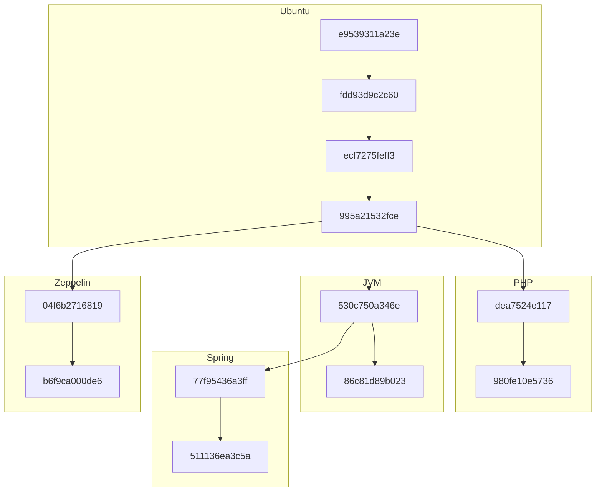
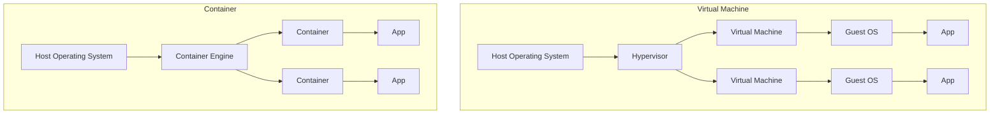

## Introduction
- Docker's rise since its 2013 launch.
- Popular for its automation and container deployment capabilities.
- Offers portability, consistency, and efficiency.

---

## Basic Architecture
- Docker: Automates deployment inside software containers.
- Containers: Isolated instances enabled by the OS kernel.
- Multiple implementations; Docker is a prominent one.

---

## Docker Images and Dockerfiles
- Docker operates using 'images', which are like blueprints for containers.
- Dockerfiles define how to build these images.

---

### Dockerfile


- Example Dockerfile: Sets up OpenJDK, installs Python, and prepares the environment.

```docker
FROM openjdk:8u212-jdk-slim
RUN apt-get update \
  && apt-get install -y --no-install-recommends \
    Python3=3.5.3-1 \
    Python3-pip=9.0.1-2+deb9u1 \
  && rm -rf /var/lib/apt/lists/*
COPY requirements.txt requirements.txt
RUN pip3 install --upgrade -r requirements.txt
```

---

## Docker Registries and Hosts
- Images stored in repositories, known as Docker registries.
- Docker Hub is a popular public registry.
- Docker host: A Linux machine running the Docker daemon.

---

## Docker Architecture Overview
- Illustration of Docker's basic architecture.
- Interaction between client, host, and registry.

---

### Stackable Image Layers and Copy-On-Write
- Docker images are built in layers, each layer adding changes.
- Example: An image layer adding Python on top of an Ubuntu base.
- Efficiency through shared, immutable layers and copy-on-write.



---

## Connecting the Technical Dots
- Docker simplifies container creation using Linux capabilities.
- Streamlines deployment without deep Linux expertise.

---

## Opportunities and Challenges of Docker
- Examining the benefits and potential issues with Docker adoption.
- Balancing Docker's capabilities with real-world deployment considerations.

---

## Opportunities with Docker
- Facilitates DevOps and CI/CD practices.
- Predictable deployments: "It works on my machine" problem solved.
- Integrates with major cloud and cluster managers.
- Enables quick scaling and fast failure recovery.

---

## Challenges in Docker Adoption
- Security misconceptions: Containers don't inherently secure applications.
- Risk of deploying inadequate or insecure containerized solutions.
- The "fat container" anti-pattern: Avoid heavy, complex containers.
- Deep Linux knowledge may be required for specific issues.

---

## Frequently Asked Questions About Docker

---

### Containers vs Virtual Machines
- Understanding the conceptual differences.
- Containers: Lightweight, use the host OS kernel, efficient for isolated applications.
- VMs: Heavier, require a hypervisor, suited for complete OS isolation.



---

### Do Containers Truly Isolate?
- Containers provide isolation, but not absolute security.
- Proper configuration is key.
- Containers interact with the host and other containers, creating potential security gaps.

---

### Impact of Containers on Production Stability
- Containers can increase stability but don't guarantee error-free applications.
- Proper configuration and understanding of container interactions are crucial.
- Containers facilitate quick recovery and scaling.

---

## Conclusion
- Docker: A powerful tool for efficient, isolated, and reproducible deployments.
- Requires understanding of its ecosystem and underlying Linux features.
- Not a one-size-fits-all solution; assess requirements before adoption.

---

"Putting broken software into a Docker container doesn't make it any less broken."
