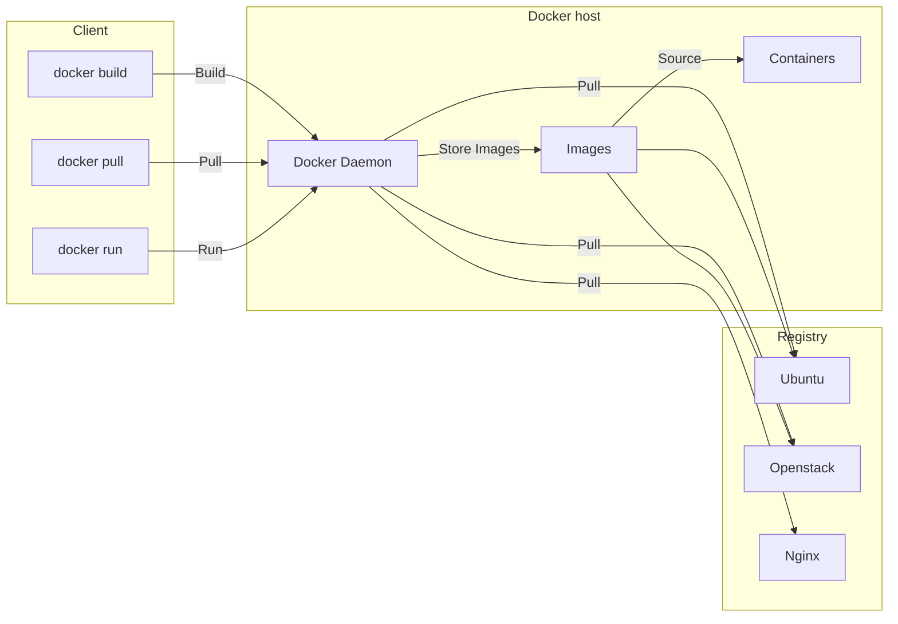
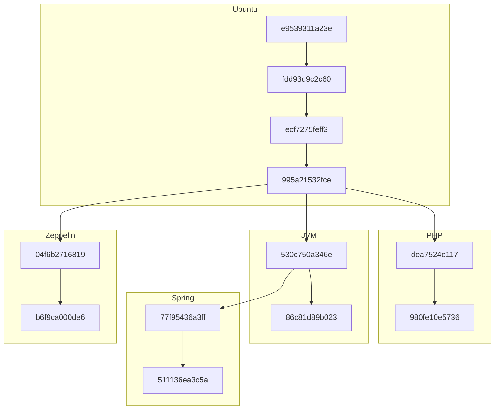
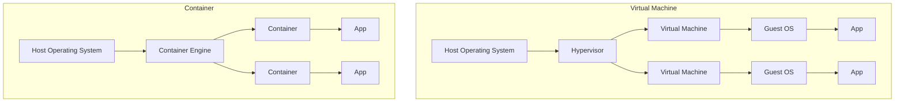

> [!info]- Contents
> Docker is a popular platform for containerization, automating application deployment and management. Docker images, created using Dockerfiles, provide consistent environments across different platforms. Containers share the host OS kernel, offering isolation but not foolproof security.
> #### Table of Contents
> <!-- TOC -->
>  * [Introduction](#introduction)
>  * [Basic Architecture](#basic-architecture)
>  * [Docker Images and Dockerfiles](#docker-images-and-dockerfiles)
>    * [Dockerfile](#dockerfile)
>  * [Docker Registries and Hosts](#docker-registries-and-hosts)
>  * [Docker Architecture Overview](#docker-architecture-overview)
>    * [Stackable Image Layers and Copy-On-Write](#stackable-image-layers-and-copy-on-write)
>  * [Frequently Asked Questions About Docker](#frequently-asked-questions-about-docker)
>    * [Containers vs Virtual Machines](#containers-vs-virtual-machines)
>    * [Do Containers Truly Isolate?](#do-containers-truly-isolate)
>      * [Live demo: docker-compose](#live-demo-docker-compose)
>  * [Conclusion](#conclusion)
>      * [Remember](#remember)
> <!-- TOC -->

## Introduction

Since its launch in 2013, **Docker** has rapidly become a popular tool in the software development industry.
Docker is a platform designed to automate the deployment, scaling,
and management of applications using containerization technology.

Why use Docker?
Because you can run the same application on your local machine, on a server, or in the cloud without any changes.

```bash
docker run -d -p 80:80 nginx  # Run Nginx in a container
```

Key advantages of Docker include:
- **Automation and Container Deployment**
  - Simplifies the process of packaging applications and their dependencies into containers.
- **Portability**
  - Ensures applications run consistently across various environments, from development to production.
- **Consistency and Efficiency**
  - Streamlines workflows by providing a consistent environment, leading to efficient resource utilization.


---

## Basic Architecture

**Docker** automates the deployment of applications inside software containers, providing an additional layer of abstraction and automation of operating-system-level virtualization.
- **Containers**: Lightweight, standalone, and executable packages that include everything needed to run a piece of software, including code, runtime, system tools, and libraries. 
  - Containers leverage the host OS kernel, enabling isolated instances without the overhead of full virtual machines.
- **Multiple Implementations**: While Docker is a leading platform for containerization, there are other implementations like LXC (Linux Containers), rkt, and containerd.

> [!TIP]
> Though Docker stands out due to its comprehensive ecosystem and user-friendly tooling,
> after Docker Desktop became a paid service,
> the community has been actively exploring [many different alternatives](https://www.reddit.com/r/docker/comments/19815c9/alternative_to_docker_desktop/),
> that also work well.

Docker's architecture allows developers to package applications into containers,
ensuring that they run reliably in different computing environments.

---

## Docker Images and Dockerfiles

Docker operates using **images**, which serve as templates for creating Docker containers.
- **Docker Images**: Immutable files that contain the source code, libraries, dependencies, and tools needed for an application to run. 
  - They are the building blocks of Docker containers.
- **Dockerfiles**: Simple text files that provide a set of instructions for building a Docker image. 
  - They define the base image to use, the commands to run, and the files to include, they are **blueprints for creating images.**

---

### Dockerfile

Here is an example of a Dockerfile that sets up an environment with OpenJDK,
installs Python, and prepares necessary dependencies:

```dockerfile
FROM openjdk:latest                               # Base image with OpenJDK
RUN apt-get update \
  && apt-get install -y --no-install-recommends \ # Install Python 3 and pip3
    python3=3.5.3-1 \
    python3-pip=9.0.1-2+deb9u1 \
  && rm -rf /var/lib/apt/lists/*                  # Clean up package lists
COPY requirements.txt requirements.txt            # Copy Python dependencies manifest
RUN pip3 install --upgrade -r requirements.txt    # Install Python dependencies
```

The default [shell](courses/missing_semester/2024-10-05-1#using-the-shell) for Docker commands is `/bin/sh`, but you can specify a different shell using the `SHELL` instruction in the Dockerfile.

```dockerfile
SHELL ["/bin/bash", "-c"]
```

All available instructions for Dockerfiles can be found in the [official Docker documentation](https://docs.docker.com/reference/dockerfile/).

---

## Docker Registries and Hosts

- **Docker Registries** are central repositories where Docker images are stored and distributed. 
  - They function like code repositories but for container images.
      - [**Docker Hub**](https://hub.docker.com/): The most widely used public registry, allowing users to share and access images. It hosts official images for popular software.
- **Docker Host** is a machine (physical or virtual) that runs the Docker daemon (`dockerd`). 
  - The host is responsible for building, running, and managing Docker containers.

---

## Docker Architecture Overview

Docker's architecture is based on a client-server model that consists of:

- **Docker Client**: The interface through which users interact with Docker. 
  - Commands entered the client are sent to the Docker daemon.
- **Docker Daemon**: Runs on the host machine and performs tasks such as building, running, and distributing containers.
- **Docker Registries**: Where Docker images are stored. 
  - The daemon interacts with registries to pull images required to run containers or to push newly built images.

**Workflow**:

1. **User Input**: The user issues a command via the Docker client (e.g., `docker run`).
2. **Processing**: The client sends the command to the Docker daemon.
3. **Execution**: The daemon performs the requested action (e.g., starts a container).
4. **Interaction with Registry**: If necessary, the daemon pulls the required image from a Docker registry.



---

### Stackable Image Layers and Copy-On-Write

Docker images are composed of [layers stacked on top of each other](https://www.youtube.com/watch?v=-FtCTW2rVFM).
- **Image Layers**: Each instruction in a Dockerfile creates a new layer. 
  - Layers are cached and reused, making builds faster and more efficient.
- **Copy-On-Write**: When a container is run, it adds a thin writable layer on top of the image layers. 
  - Any changes made during the container's execution are stored in this layer.

Copy-On-Write also means
it's possible to commit changes to a container and create a new image based on the modified container.

```bash
docker run --rm -it ubuntu:latest /bin/bash
docker ps -a
docker commit <container_id> my-own-ubuntu
```

**Example**:
- **Base Layers**: Start with an Ubuntu base image.
- **Additional Layers**: Add Python, Java, or application code on top of the base image.

**Benefits**:
- Shared layers reduce disk space usage and speed up image downloads.
- Underlying layers remain unchanged, promoting consistency.



## Frequently Asked Questions About Docker

### Containers vs Virtual Machines
Understanding the differences between containers and virtual machines (VMs) is important.

**Containers**:
- **Lightweight**: Share the host OS kernel, requiring fewer resources.
- **Isolation**: Provide application-level isolation, ideal for microservices and scalable applications.
- **Efficiency**: Faster startup times and reduced overhead compared to VMs.

**Virtual Machines**:
- **Heavier**: Include a full guest OS, consuming more resources.
- **Complete Isolation**: Offer hardware-level isolation, suitable for running different OS types or when strong security boundaries are needed.
- **Use Cases**: Preferred when applications require full OS functionality or when running untrusted code.




Choosing between containers and VMs depends on the specific requirements of the application and infrastructure.

---

### Do Containers Truly Isolate?

*Docker is not about security, it's about isolation.*

While containers provide a degree of isolation, they are not foolproof security mechanisms.
- **Isolation Limitations**: Containers share the host OS kernel, so a kernel vulnerability could compromise all containers.
- **Proper Configuration**: Security best practices (e.g., using minimal base images, not running as root) are critical to enhance container security.
- **Potential Security Gaps**: Misconfigurations or vulnerabilities in container images can expose the host system or other containers.
- **Additional Measures**: Tools like SELinux, AppArmor, and user namespace mapping can improve isolation.

Containers should be part of a comprehensive security strategy, not the sole protective measure.

---

#### Live demo: docker-compose

Thanks to Docker Compose, you can define and run multi-container Docker applications using a YAML file.

Also, thanks to Docker, you do not need to install a database on your local machine to test your application.

```yaml
# Use postgres/example user/password credentials
version: '3.9'

services:

  db:
    image: postgres
    restart: always
    # set shared memory limit when using docker-compose
    shm_size: 128mb
    # or set shared memory limit when deploy via swarm stack
    #volumes:
    #  - type: tmpfs
    #    target: /dev/shm
    #    tmpfs:
    #      size: 134217728 # 128*2^20 bytes = 128Mb
    environment:
      POSTGRES_PASSWORD: example

  adminer:
    image: adminer
    restart: always
    ports:
      - 8080:8080
```

---

## Conclusion

> "Putting broken software into a Docker container doesn't make it any less broken."

Implementing Docker effectively means
looking at the whole picture—from how you develop your application to how you deploy and maintain it.
Here are some key takeaways:

- Consistency Across Environments
  - Docker containers ensure your applications run the same way in development, testing, and production, reducing issues caused by different setups.
- Not a Magic Fix
  - While Docker offers many benefits, it doesn’t automatically solve bugs or performance problems in your applications. You still need to address these issues directly.
- Proper Configuration is Crucial
  - Allocating resources correctly and understanding how containers interact are essential for stability and performance.
- Easy Scaling and Recovery
  - Docker makes it simple to deploy and scale applications quickly, which can improve your system’s resilience and make recovery easier.
- Need for Monitoring
  - Even with Docker, ongoing monitoring is important to ensure your applications perform well in real-world conditions.

#### Remember

- **Efficiency and Isolation**: Docker provides isolated environments that improve efficiency and prevent conflicts between different software setups.
- **Learning Required**: To use Docker well, you need to understand its tools and best practices, especially regarding security and managing multiple containers.
- **Not Always the Best Fit**: Docker is powerful but may not suit every project. Consider your specific needs before deciding to use it.

