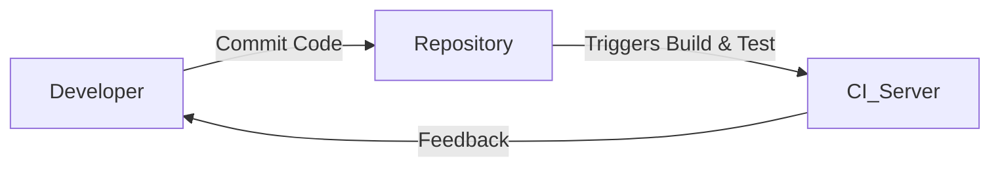

> [!info]- Contents
> Build systems automate the software development process by defining dependencies, targets, and rules. They optimize the build process by detecting changes, parallelizing tasks, and automating steps. Continuous Integration (CI) systems automate the process of building and testing code every time a change is pushed, helping to detect integration errors early and improve software quality.
> #### Table of Contents
> <!-- TOC -->
>* [Build Systems](#build-systems)
>  * [Introduction](#introduction)
>  * [What is a Build System?](#what-is-a-build-system)
>  * [The Make Build System](#the-make-build-system)
>  * [Basic Structure of a Makefile](#basic-structure-of-a-makefile)
>  * [Let's Write a Makefile](#lets-write-a-makefile)
>  * [Variables in Makefiles](#variables-in-makefiles)
>  * [Best Practices](#best-practices)
>      * [Use Variables](#use-variables)
>      * [Pattern Rules](#pattern-rules)
>      * [Phony Targets](#phony-targets)
>      * [Comments:](#comments)
>      * [More](#more)
>  * [Dependency Management](#dependency-management)
>  * [Semantic Versioning](#semantic-versioning)
>      * [Benefits](#benefits)
>      * [Example:](#example)
>  * [Lock Files and Vendoring](#lock-files-and-vendoring)
>      * [Use Lock Files](#use-lock-files)
>      * [Vendoring Dependencies:](#vendoring-dependencies)
>* [Continuous Integration Systems](#continuous-integration-systems)
>  * [Overview of CI Systems](#overview-of-ci-systems)
>  * [CI Configuration](#ci-configuration)
>      * [Live example](#live-example)
> <!-- TOC -->

# Build Systems

## Introduction

In software development,
the **build process** refers to the sequence of steps that transform source code and resources
(inputs) into executable programs,
libraries, or other artifacts
(outputs).

This process can include compiling code, linking libraries, running tests, and packaging applications.

- A **build system** is a tool designed to automate and manage this build process.
- It defines how to build your project, specifying dependencies, targets, and rules. 
- By automating the build process, build systems help ensure consistency, efficiency, and accuracy in software development.

---

## What is a Build System?

A build system is a tool that:

- **Defines Dependencies**: Specifies how different parts of your project depend on each other. For example, a source file may depend on a header file.
- **Specifies Targets**: Targets are the final outputs you want to produce, such as executables, libraries, or documentation.
- **Sets Rules**: Rules describe how to build targets from their dependencies using specific commands.

Build systems manage and optimize the build process by:

- **Detecting Changes**: Only rebuilding parts of the project that have changed.
- **Parallelizing Tasks**: Running independent build steps simultaneously to save time.
- **Automating Tasks**: Reducing manual effort and potential for errors.

Examples of build systems include:

- **`make`**: A classic build automation tool.
- **Specialized Tools**: Such as Maven for Java, Gradle for multiple languages, or Cargo for Rust.
- **Build Systems for Large Projects**: Like Bazel or Buck, designed to handle complex dependencies and scaling issues.

---

## The Make Build System

**Make** is one of the most common and historically significant build systems. It uses a file called a `Makefile` to define how your project should be built.

Key features of Make:

- **Rules and Targets**: Define how to build each part of your project.
- **Dependencies**: Specify which files or targets depend on others.
- **Commands**: Shell commands that perform the actual build steps.

A simple example of a `Makefile`:

```make
hello:
    echo "Hello, World"
```

In this example:

- **`hello`** is a target.
- The command `echo "Hello, World"` is executed when you run `make hello`.

---

## Basic Structure of a Makefile

A `Makefile` consists of rules with the following structure:

```make
target: dependencies
    command
```

- **Target**: The file or action you want to create or update.
- **Dependencies**: Files that the target depends on. If any dependencies are newer than the target, the command is executed.
- **Command**: The shell command that Make executes to build the target. It must be preceded by a tab character.

Example:

```make
program: main.o utils.o
    gcc -o program main.o utils.o
```

- **Target**: `program`
- **Dependencies**: `main.o`, `utils.o`
- **Command**: Compiles the object files into an executable named `program`.

> [!NOTE]
> As we saw on the lecture, indentation is crucial in `Makefiles`. Use a tab character, not spaces, before each command.

---

## Let's Write a Makefile

Let's create a `Makefile` for a simple C program:

```make
# Default target when you run `make`.
# Depends on `hello`, which triggers the build of `hello`.
all: hello

# Depends on `hello.o`.
# Compiles `hello.o` into an executable named `hello`.
hello: hello.o
    gcc -o hello hello.o

# Depends on `hello.c`.
# Compiles `hello.c` into the object file `hello.o`.
hello.o: hello.c
    gcc -c hello.c

# Clean up generated files.
clean:
    rm -f hello hello.o
```

And here's our simple program `hello.c`:

```c
#include <stdio.h>

int main() {
    printf("Hello, World\n");
    return 0;
}
```

To use this `Makefile`:

1. Run `make` to build the `hello` program.
2. Run `./hello` to execute the program.
3. Run `make clean` to remove the compiled files.

---

## Variables in Makefiles

Variables in Makefiles allow you to define reusable values and simplify maintenance.

Common variables:

- **`CC`**: The compiler to use (e.g., `gcc`, `clang`).
- **`CFLAGS`**: Compiler flags (e.g., `-Wall` for warnings, `-g` for debugging symbols).

Automatic variables:

- **`$@`**: The target name of the rule.
- **`$^`**: All the dependencies of the rule.
- **`$<`**: The first dependency of the rule.

Rewriting the previous `Makefile` with variables:

```make
CC = gcc            # compiler to use
CFLAGS = -Wall -g   # compiler flags for warnings and debugging

all: hello

hello: hello.o
    $(CC) $(CFLAGS) -o $@ $^

hello.o: hello.c
    $(CC) $(CFLAGS) -c $<

clean:
    rm -f hello hello.o

# declares that `all` and `clean` are not files but commands.
.PHONY: all clean
```

---

## Best Practices

To write effective `Makefiles`, consider the following best practices:

#### Use Variables
- Define variables for compilers, flags, and common paths.
- Makes it easier to update and maintain the `Makefile`. 

#### Pattern Rules
- Use pattern rules to generalize commands for multiple files.
  - Example:
    ```make
    %.o: %.c
        $(CC) $(CFLAGS) -c $<
    ```
#### Phony Targets
- Declare phony targets to avoid conflicts with files of the same name.
- Ensures commands are executed even if a file with the target's name exists.

#### Comments:
- Use comments to explain complex rules or variables.
- Improves readability and maintainability.

  ```make
  # Compile the hello program from object files
  ```
#### More
- If your `Makefile` becomes too complex, consider splitting it into smaller files.
- Or use more advanced build systems suited for larger projects.

---

## Dependency Management

Modern software projects often depend on external code, libraries, or modules.

- **Dependencies**:
    - External code that your project requires to function.
    - Could be libraries, frameworks, or other modules.
- **Managing Dependencies**:
    - Use package managers or dependency management tools specific to your programming language.
    - Examples: `npm` for JavaScript, `pip` for Python, `Cargo` for Rust.
- **Versioning**:
    - Specify exact versions or version ranges for dependencies.
    - Ensures compatibility and reproducibility.


Proper dependency management:
- **Ensures Stability**:
    - By locking versions, you prevent unexpected changes from affecting your project.
- **Facilitates Collaboration**:
    - Team members can set up the project environment consistently.
- **Simplifies Deployment**:
    - Dependencies are clearly defined, making it easier to deploy applications.

---

## Semantic Versioning

**Semantic Versioning** is a widely adopted versioning scheme that conveys meaning about the underlying changes in a release.

- **Format**: `MAJOR.MINOR.PATCH` (e.g., `1.0.3`).
- **Version Number Increments**:
    - **MAJOR** version (`1.x.x`):
        - Incremented when you make incompatible API changes.
        - Indicates breaking changes.
    - **MINOR** version (`x.1.x`):
        - Incremented when you add functionality in a backward-compatible manner.
        - Indicates new features.
    - **PATCH** version (`x.x.1`):
        - Incremented when you make backward-compatible bug fixes.
        - Indicates minor changes and fixes.

#### Benefits
- Help users understand the impact of updating to a new version.
- Facilitates dependency management by specifying compatible versions.

#### Example:
- Updating from `1.2.3` to `1.3.0` adds new features but remains compatible.
- Updating from `1.2.3` to `2.0.0` may introduce breaking changes.

---

## Lock Files and Vendoring

To maintain consistent environments and builds, you can:

#### Use Lock Files
- Generated by package managers to record the exact versions of dependencies used.
- Examples:
    - `package-lock.json` for npm.
    - `Pipfile.lock` for pipenv.
- Ensures that everyone working on the project uses the same dependency versions.

#### Vendoring Dependencies:
- Copying all dependency code into your project's repository.
- Provides full control over dependencies.
- Protects against changes or removal of external resources.
- Examples:
  - `node_modules` for npm.
  - `go vendor` for Go.
- **Benefits**:
    - **Consistency**: Reproducible builds across different environments.
    - **Stability**: Avoids unexpected updates from breaking your project.
    - **Offline Builds**: Ability to build without internet access.
- **Considerations**:
    - Vendoring can increase repository size.
    - Must manage updates to dependencies manually.

---

# Continuous Integration Systems

---

## Overview of CI Systems

**Continuous Integration (CI)** is a development practice where developers integrate code into a shared repository frequently, and each integration is verified by an automated build and test process.



- **Purpose**:
    - Detect integration errors early.
    - Automate testing, building, and deployment.
    - Improve software quality.
- **CI Systems**:
    - Tools that automate the process of building and testing code every time a change is pushed.
    - Help enforce code quality standards.
- **Examples**:
    - **Travis CI**: Popular CI service integrated with GitHub.
    - **Azure Pipelines**: Part of Azure DevOps, supports multiple languages and platforms.
    - **GitHub Actions**: Allows automation directly within GitHub repositories.

---

## CI Configuration

CI systems are configured using files that define workflows, typically stored in your repository.

- **Configuration Files**:
    - Define the steps the CI system should perform.
    - Specify triggers, such as pushes or pull requests.

- **Common Elements**:
    - **Jobs**: Independent tasks that run as part of the workflow.
    - **Steps**: Commands executed within a job.
    - **Environments**: Operating systems and runtime environments.

- **Example (GitHub Actions)**:

To get a basic understanding how CI systems work nowadays, you can just start using GitHub Actions.
They are free for public repositories and provide a wide range of pre-built actions.

  Create a file `.github/workflows/ci.yml`:

  ```yaml
  name: CI
  on:                                # triggers: runs on pushes or pull requests to the `main` branch.
    push:
      branches: [ main ]
    pull_request:
      branches: [ main ]
  jobs:
    build:                           # job named `build`
      runs-on: ubuntu-latest
      steps:
      - uses: actions/checkout@v4    # checkout the repository
      - name: Set up Node.js
        uses: actions/setup-node@v2  
        with:
          node-version: '14'
      - name: Install dependencies
        run: npm install
      - name: Run tests
        run: npm test
  ```

You can customize this file to fit your project's requirements.
Also, you can create your own actions. 

I authored a few of them, one of the most popular is for [Qodana](https://github.com/marketplace/actions/qodana-scan)

---

#### Live example
Available only for those who visited the Constructor University that day :)
Still, the documentation is pretty straightforward.


Host your own blog with GitHub Pages:

```yaml
# Sample workflow for building and deploying a Jekyll site to GitHub Pages
name: Deploy Jekyll with GitHub Pages dependencies preinstalled

on:
  # Runs on pushes targeting the default branch
  push:
    branches: ["main"]

  # Allows you to run this workflow manually from the Actions tab
  workflow_dispatch:

# Sets permissions of the GITHUB_TOKEN to allow deployment to GitHub Pages
permissions:
  contents: read
  pages: write
  id-token: write

# Allow only one concurrent deployment, skipping runs queued between the run in-progress and latest queued.
# However, do NOT cancel in-progress runs as we want to allow these production deployments to complete.
concurrency:
  group: "pages"
  cancel-in-progress: false

jobs:
  # Build job
  build:
    runs-on: ubuntu-latest
    steps:
      - name: Checkout
        uses: actions/checkout@v4
      - name: Setup Pages
        uses: actions/configure-pages@v5
      - name: Build with Jekyll
        uses: actions/jekyll-build-pages@v1
        with:
          source: ./
          destination: ./_site
      - name: Upload artifact
        uses: actions/upload-pages-artifact@v3

  # Deployment job
  deploy:
    environment:
      name: github-pages
      url: ${{ steps.deployment.outputs.page_url }}
    runs-on: ubuntu-latest
    needs: build
    steps:
      - name: Deploy to GitHub Pages
        id: deployment
        uses: actions/deploy-pages@v4
```
